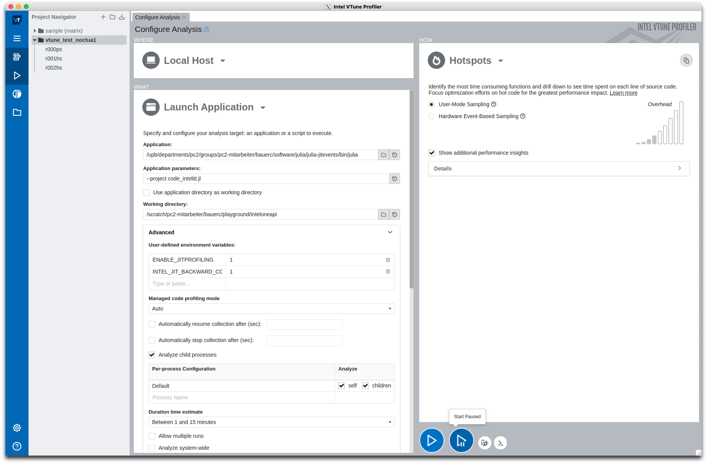

# Julia + Intel VTune

## Preparation
* Build Julia from source
  * Modules used on the Noctua 1 cluster at the [Paderborn Center for Parallel Computing (PC2)](https://pc2.uni-paderborn.de), see `modules_noctua1.sh`.
  * Then, I cloned the [Julia source code](https://github.com/JuliaLang/julia), perhaps not master but a specific release (I used the `release-1.9` branch), and created a `Make.user` file with the following content
  ```
  USE_INTEL_JITEVENTS=1
  prefix = /upb/departments/pc2/groups/pc2-mitarbeiter/bauerc/software/julia/julia-jitevents # optional
  ```
  * Build with `make -j 40` and, optionally, `make install` afterwards.

## Running Julia under VTune

In my case, the self-compiled julia with Intel JIT events enabled is now in `/upb/departments/pc2/groups/pc2-mitarbeiter/bauerc/software/julia/julia-jitevents/bin/julia`. We can now run our Julia code under VTune. The only import thing is to set the environment variables `ENABLE_JITPROFILING=1` and `INTEL_JIT_BACKWARD_COMPATIBILITY=1`.

There are two ways to run your code with VTune:

* using the CLI tool `vtune` (see `1_vtune_cli_collect.sh` for an example)
* using the GUI

As for the GUI, apart from setting the environment variables above in the "Advanced" section the only thing to mention is that it's probably a good idea to "Start paused".



## Analysing the results

If you ran Julia under the GUI already (option 2 above) you can analyze the results in the GUI directly. If you went for the CLI tool (option 1) there are two ways to proceed. Either you generate textual reports (see `2b_vtune_cli_repots.sh` for examples) or you open the results with `vtune-gui` to visualize them in the GUI (`2a_vtune_gui_analysis.sh`).


